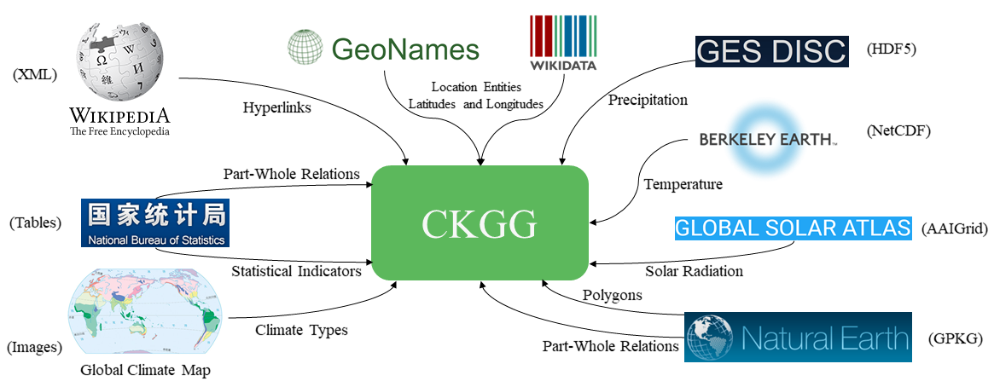
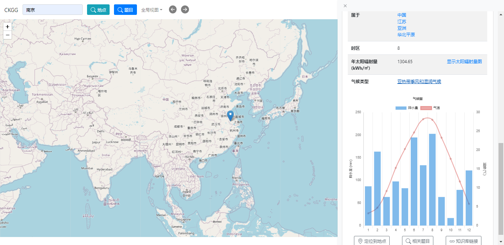
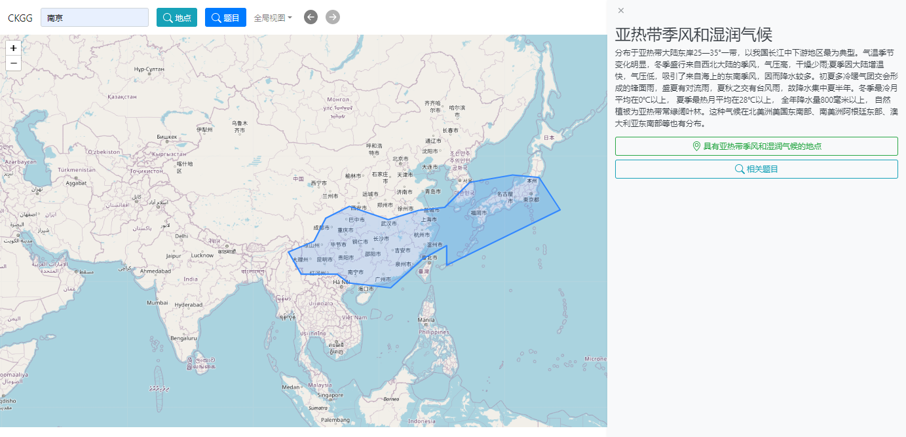
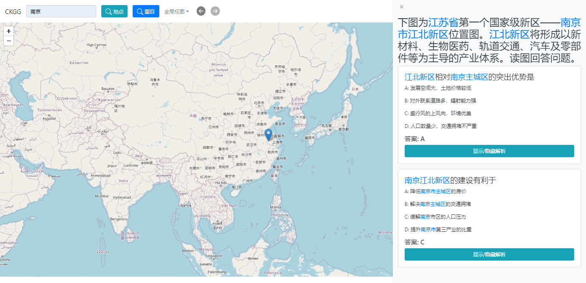

# CKGG: A Chinese Knowledge Graph for High-School Geography Education and Beyond



## Project Structure

- Ontology: [ontology.owl](ontology.owl)
- Manual ontology mapping to Clinga: [mapping.owl](mapping.owl)
- VoID Metadata: [void_metadata.ttl](void_metadata.ttl)
- Source for importing and transforming data: [jenadataload/](./jenadataload/)
- Source for ontology and ontology generation script: [ontology/](./ontology/)
- Source for build NBS data: [nbs_data/](./nbs_data/)
- Source for demo frontend: [gkbdemo/](./gkbdemo/)
- Source for demo backend: [api/](./api/)
- Source for image data and annotated gis polygons: [image_data/](./image_data/)
- Other sample docs and images: [docs/](./docs/)

## RDF Dumps

- Standard Version: [](https://doi.org/10.5281/zenodo.4668711)
- Reified Version: [](https://doi.org/10.5281/zenodo.4678089)

## Namespaces

```sparql
PREFIX ckgc: <http://w3id.org/ckgg/1.0/ontology/classes/>
PREFIX ckgp: <http://w3id.org/ckgg/1.0/ontology/properties/>
PREFIX ckgg: <http://w3id.org/ckgg/1.0/instances/location/>
PREFIX ckga: <http://w3id.org/ckgg/1.0/instances/auxiliary/>
```

## How to Access

### Demo

We developed a prototype educational information system at [http://w3id.org/ckgg/1.0/demo](http://w3id.org/ckgg/1.0/demo). Users can use this system to search and browse geographical knowledge in and related CKGG. Its source code is in [./gkbdemo](./gkbdemo/) and [./api](./api/).







### Linked Data

CKGG is accessible as Linked Data. For example, by dereferencing `<http://w3id.org/ckgg/1.0/instances/location/724467>` one can obtain the following [RDF](./docs/example.rdf) document.

```xml
<?xml version="1.0" encoding="utf-8" ?>
<rdf:RDF
	xmlns:rdf="http://www.w3.org/1999/02/22-rdf-syntax-ns#"
	xmlns:rdfs="http://www.w3.org/2000/01/rdf-schema#"
	xmlns:owl="http://www.w3.org/2002/07/owl#"
	xmlns:geo="http://www.w3.org/2003/01/geo/wgs84_pos#"
	xmlns:ckgp="http://w3id.org/ckgg/1.0/ontology/properties/" >

  <rdf:Description rdf:about="http://w3id.org/ckgg/1.0/instances/location/2197017">
    <ckgp:P10 rdf:resource="http://w3id.org/ckgg/1.0/instances/location/724467" />
    <ckgp:P14 rdf:resource="http://w3id.org/ckgg/1.0/instances/location/724467" />
  </rdf:Description>
  <rdf:Description rdf:about="http://w3id.org/ckgg/1.0/instances/location/2834351">
    <ckgp:P18 rdf:resource="http://w3id.org/ckgg/1.0/instances/location/724467" />
  </rdf:Description>
  <!-- ... (part-whole relations) -->

  <rdf:Description rdf:about="http://w3id.org/ckgg/1.0/instances/location/724467">
    <rdf:type rdf:resource="http://w3id.org/ckgg/1.0/ontology/classes/Q5" />
    <rdf:type rdf:resource="http://w3id.org/ckgg/1.0/ontology/classes/Q805" />
    <!-- (types) -->
    
    <rdfs:label xml:lang="zh-cn">南京市</rdfs:label>
    <rdfs:label xml:lang="en">Nanjing</rdfs:label>
    <!-- ... (labels) -->

    <owl:sameAs rdf:resource="http://sws.geonames.org/1799960" />
    <owl:sameAs rdf:resource="http://sws.geonames.org/1799962" />
    <owl:sameAs rdf:resource="http://www.wikidata.org/entity/Q28794795" />
    <owl:sameAs rdf:resource="http://www.wikidata.org/entity/Q16666" />
    <!-- ... (sameAs Links) -->

    <geo:lat rdf:datatype="http://www.w3.org/2001/XMLSchema#double">31.9657</geo:lat>
    <geo:lon rdf:datatype="http://www.w3.org/2001/XMLSchema#double">118.873</geo:lon>
    <!-- (latitude, longitude) -->

    <ckgp:P177 rdf:datatype="http://www.w3.org/2001/XMLSchema#long">7165292</ckgp:P177>
    <!-- (population) -->

    <ckgp:P22 rdf:datatype="http://www.w3.org/2001/XMLSchema#double">10.0</ckgp:P22>
    <!-- (altitude) -->

    <ckgp:P10 rdf:resource="http://w3id.org/ckgg/1.0/instances/location/7431525" />
    <!-- ... (part whole relations) -->

    <ckgp:P12 rdf:resource="http://w3id.org/ckgg/1.0/instances/location/2834351" />
    <ckgp:P13 rdf:resource="http://w3id.org/ckgg/1.0/instances/location/336585" />
    <ckgp:P14 rdf:resource="http://w3id.org/ckgg/1.0/instances/location/724467" />
    <!-- ... (administrative divisions) -->

    <ckgp:P18 rdf:resource="http://w3id.org/ckgg/1.0/instances/location/1447776" />
    <!-- ... (part whole relations) -->

    <ckgp:P26 rdf:datatype="http://www.w3.org/2001/XMLSchema#double">220080.0</ckgp:P26>
    <!-- (distance to ocean (meter)) -->

    <ckgp:P39 rdf:datatype="http://www.w3.org/2001/XMLSchema#double">1304.65</ckgp:P39>
    <!-- (annual solar radiation (Kwh/m^2)) -->

    <ckgp:P48 rdf:resource="http://w3id.org/ckgg/1.0/instances/auxiliary/I276" />
    <!-- (timezone, dereference to get name and GMT offset) -->

    <ckgp:P6 rdf:datatype="http://www.w3.org/2001/XMLSchema#anyURI">https://zh.wikipedia.org/wiki/南京市</ckgp:P6>
    <ckgp:P6 rdf:datatype="http://www.w3.org/2001/XMLSchema#anyURI">https://en.wikipedia.org/wiki/Nanjing</ckgp:P6>
    <!-- (Wikipedia links) -->

    <ckgp:P7 rdf:datatype="http://www.w3.org/2001/XMLSchema#int">4783</ckgp:P7>
    <!-- (Ranking score) -->

    <ckgp:P71 rdf:datatype="http://www.w3.org/2001/XMLSchema#double">16.0081</ckgp:P71>
    <!-- (Annual Average Temperature) -->

    <ckgp:P75 rdf:nodeID="b239200884" />
    <rdf:Description rdf:nodeID="b239200884">
        <rdf:type rdf:resource="http://w3id.org/ckgg/1.0/ontology/classes/Q1632" />
        <ckgp:P1633 rdf:datatype="http://www.w3.org/2001/XMLSchema#int">6</ckgp:P1633>
        <ckgp:P1634 rdf:datatype="http://www.w3.org/2001/XMLSchema#double">24.6822</ckgp:P1634>
    </rdf:Description>
    <!-- ... (Monthly Average Temperature, P1633 is month, P1634 is value (in celsius degree)) -->

    <ckgp:P762>3201</ckgp:P762>
    <ckgp:P762>320100000000</ckgp:P762>
    <!-- ... (Admin codes) -->

    <ckgp:P8>P.PPLA</ckgp:P8>
    <ckgp:P8>A.ADM2</ckgp:P8>
    <!-- ... (GeoNames feature codes) -->

    <ckgp:P86 rdf:resource="http://w3id.org/ckgg/1.0/instances/auxiliary/I449" />
    <!-- ... (Climate type) -->

    <ckgp:P89 rdf:datatype="http://www.w3.org/2001/XMLSchema#double">1.30435</ckgp:P89>
    <!-- (Annual Total Precipitation) -->

    <ckgp:P90 rdf:nodeID="b93031233" />
    <rdf:Description rdf:nodeID="b93031233">
        <rdf:type rdf:resource="http://w3id.org/ckgg/1.0/ontology/classes/Q1629" />
        <ckgp:P1630 rdf:datatype="http://www.w3.org/2001/XMLSchema#int">9</ckgp:P1630>
        <ckgp:P1631 rdf:datatype="http://www.w3.org/2001/XMLSchema#double">0.0631102</ckgp:P1631>
    </rdf:Description>
    <!-- ... (Monthly Total Precipitation, P1630 is month, P1631 is value (in meters)) -->

  </rdf:Description>
</rdf:RDF>
```

